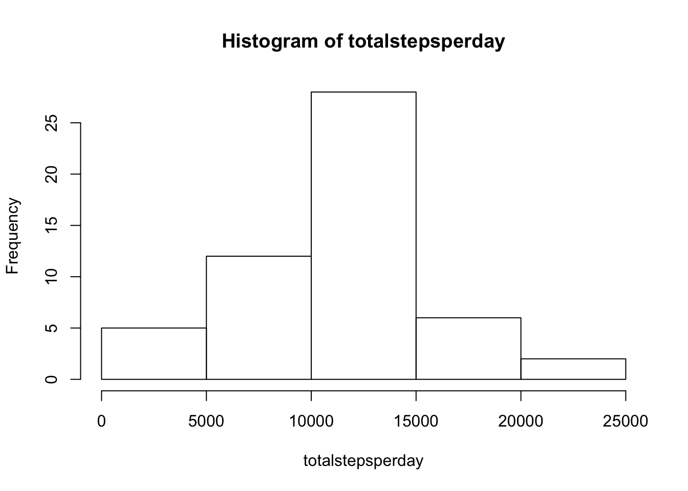
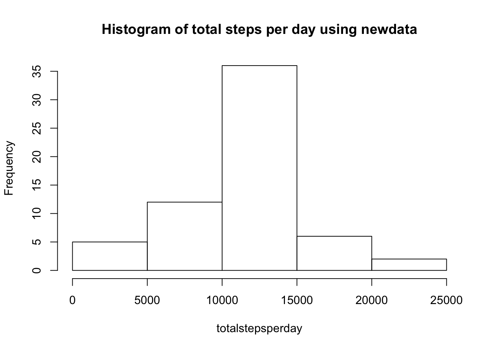
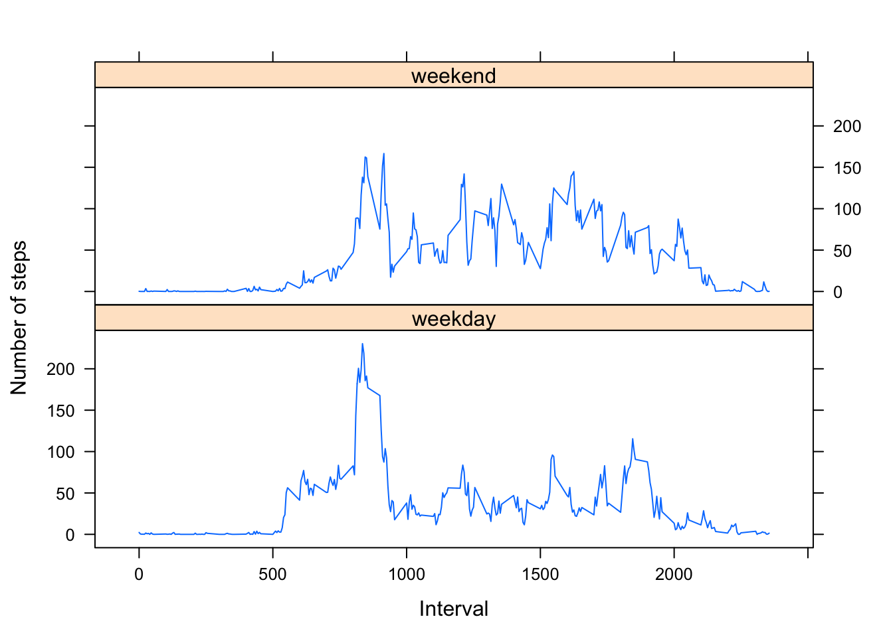

title: "courseproject1"
output: html_document
---


```r
knitr::opts_chunk$set(echo = TRUE,results = "asis")
```


```r
data <- read.csv("/Users/spandana/Desktop/activity.csv",header=TRUE)
```
## What is the mean total number of steps taken per day?

1.Calculate the total number of steps taken per day


```r
totalstepsperday <- aggregate(steps~date,data,sum,na.rm=TRUE)
```


2.Make a histogram of the total number of steps taken each day


```r
hist(totalstepsperday$steps,xlab="totalstepsperday",main="Histogram of totalstepsperday")
```


  
3. Calculate and report the mean and median of the total number of steps taken per day


```r
meansteps <- mean(totalstepsperday$steps)
meansteps
```

[1] 10766.19

```r
mediansteps <- median(totalstepsperday$steps)
mediansteps
```

[1] 10765
# What is the average daily activity pattern?

1. Make a time series plot of the 5-minute interval(x-axis) and the average number of steps taken, averaged across all days(y-axis)


```r
avgstepsperinterval <- aggregate(steps~interval,data=data,mean,na.rm=TRUE)
plot(steps~interval,data=avgstepsperinterval, type="l")
```


  
2. Which 5 minute interval, on average across all the days in the dataset, contains the maximum number of steps?


```r
intervalwithsteps <- avgstepsperinterval[which.max(avgstepsperinterval$steps),]$interval
intervalwithsteps
```

[1] 835
# Inputting missing values 

1. Calculate and report the total number of missing values in the dataset


```r
totalmissingvalues <- sum(is.na(data$steps))
totalmissingvalues
```

[1] 2304
  
2. Devise a strategy for filling in all of the missing values in the dataset 

Filling in the missing values in the dataset.For this purpose, first we will write a function below that will return the mean value for a particular interval


```r
getmeanvalueperinterval <- function(interval){
   avgstepsperinterval[avgstepsperinterval$interval==interval,]$steps
}
```
  
3. Create a new dataset that is equal to the original dataset but with the missing data filled in


```r
newdata<-data
for(i in 1:nrow(newdata)){
if(is.na(newdata[i,]$steps)){
newdata[i,]$steps <- getmeanvalueperinterval(newdata[i,]$interval)
}
}

head(newdata)
```

      steps       date interval
1 1.7169811 2012-10-01        0
2 0.3396226 2012-10-01        5
3 0.1320755 2012-10-01       10
4 0.1509434 2012-10-01       15
5 0.0754717 2012-10-01       20
6 2.0943396 2012-10-01       25

4. Make a histogram of the total number of steps taken each day and calculate and report the mean and median total number of steps taken per day. Do these values differ from the first part of the assignment? What is the impact of inputting missing data on the estimates of the total daily number of steps?


```r
totalstepsperday_newdata <- aggregate(steps ~ date, newdata, sum)
hist(totalstepsperday_newdata$steps,xlab="totalstepsperday",main="Histogram of total steps per day using newdata")
```



 

```r
meansteps_newdata <- mean(totalstepsperday_newdata$steps)
meansteps_newdata
```

[1] 10766.19

```r
mediansteps_newdata <- median(totalstepsperday_newdata$steps)
mediansteps_newdata
```

[1] 10766.19
  
# Are there differences in activity patterns between weekdays and weekends?
  
1.Create a new factor variable in the dataset with two levels -"weekday" and "weekend" indicating whether a given data is a weekday or weekend dat


```r
newdata$date <- as.Date(strptime(newdata$date, format="%Y-%m-%d"))
newdata$day <- weekdays(newdata$date)
for(i in 1:nrow(newdata)){
  if(newdata[i,]$day %in% c("Saturday","Sunday")){
    newdata[i,]$day <- "weekend"
  }
  else{
    newdata[i,]$day<-"weekday"
  }
}
stepsperday<-aggregate(newdata$steps ~ newdata$interval + newdata$day, newdata, mean)
```
  
2.Make a panel plot containing a time series plot of the 5 minute interval and the avg number of steps taken,averaged across all weekdat days or weekend days. 


```r
names(stepsperday) <- c("interval","day","steps")
library(lattice)
xyplot(steps~interval | day, stepsperday, type="l", layout = c(1,2), xlab="Interval", ylab="Number of steps")
```




>>>>>>> first commit
